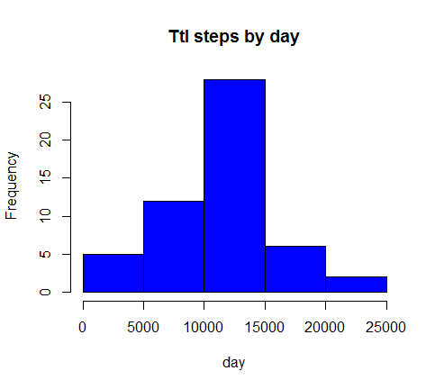
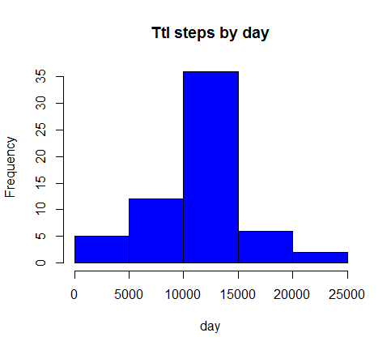
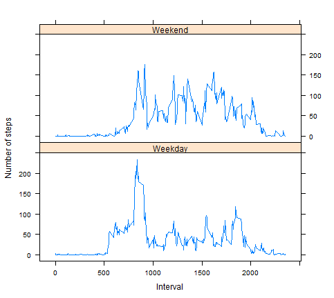

#This is reproducible research part 1  
##loading and processing the data
load it in move it out raw hide i joke but here is where i load the data and then fix it a bit

```{r}
activity <- read.csv("activity.csv", colClasses = c("numeric", "character", 
    "numeric"))
head(activity)
```
```{r}
library(lattice)
```
```{r}
activity$date <- as.Date(activity$date, "%Y-%m-%d")
```
##What is the mean total number of steps taken per day?
so ignoring the missing vlaues in the dataset the sum
```{r}
StepsTtl <- aggregate(steps ~ date, data = activity, sum, na.rm = TRUE)
```
And now for the graph as histograph not a bar plot
```{r}
hist(StepsTtl$steps, main = "Ttl steps by day", xlab = "day", col = "blue")
```
 
and now for my next trick the mean and the median
```{r}
mean(StepsTtl$steps)
```
```{r}
median(StepsTtl$steps)
```
##What is the average daily activity pattern?
I will show you a time series plot with 5 min x axis intervals  and the steps taken avergared over days y axis
```{r}
series_time <- tapply(activity$steps, activity$interval, mean, na.rm = TRUE)
plot(row.names(series_time), series_time, type = "l", xlab = "5-min interval", 
    ylab = "Average across Days(all)", main = "Average number of steps", 
    col = "blue")
```
 
And you should have seen the plot above  

so for which interval has the maximum steps

```{r}
MaxStepSlice <- which.max(series_time)
names(MaxStepSlice)
```

#Inputting the missing values
Note that there are a number of days/intervals where there are missing values (coded as NA). The presence of missing days may introduce bias into some calculations or summaries of the data.

Calculate and report the total number of missing values in the dataset (i.e. the total number of rows with NAs)

Devise a strategy for filling in all of the missing values in the dataset. The strategy does not need to be sophisticated. For example, you could use the mean/median for that day, or the mean for that 5-minute interval, etc.

Create a new dataset that is equal to the original dataset but with the missing data filled in.

Make a histogram of the total number of steps taken each day and Calculate and report the mean and median total number of steps taken per day. Do these values differ from the estimates from the first part of the assignment? What is the impact of imputing missing data on the estimates of the total daily number of steps?


lets first see what is actually missing
```{r}
missing_activity <- sum(is.na(activity))
missing_activity
```

well that is alot of missing data and just filling it with zeros is not really a option so I am going to use the mean

```{r}
StepsAvg <- aggregate(steps ~ interval, data = activity, FUN = mean)
missingfill <- numeric()
for (i in 1:nrow(activity)) {
    obs <- activity[i, ]
    if (is.na(obs$steps)) {
        steps <- subset(StepsAvg, interval == obs$interval)$steps
    } else {
        steps <- obs$steps
    }
    missingfill <- c(missingfill, steps)
}
filled_activity <- activity
filled_activity$steps <- missingfill
```
now for the histogram mean and median
```{r}
StepsTtl2 <- aggregate(steps ~ date, data = filled_activity, sum, na.rm = TRUE)
hist(StepsTtl2$steps, main = "Ttl steps by day", xlab = "day", col = "blue")
```
 
```{r}
mean(StepsTtl2$steps)
median(StepsTtl2$steps)
```
so replacing the missing values with the mean affected te mean not a jot (not effect on the Mean) and just a tad for the median(just a little bit in the median)

#Are there differences in activity patterns between weekdays and weekends?

For this part the weekdays() function may be of some help here. Use the dataset with the filled-in missing values for this part.

Create a new factor variable in the dataset with two levels - "weekday" and "weekend" indicating whether a given date is a weekday or weekend day.
```{r}
day <- weekdays(activity$date)
daylevel <- vector()
for (i in 1:nrow(activity)) {
    if (day[i] == "Saturday") {
        daylevel[i] <- "Weekend"
    } else if (day[i] == "Sunday") {
        daylevel[i] <- "Weekend"
    } else {
        daylevel[i] <- "Weekday"
    }
}
activity$daylevel <- daylevel
activity$daylevel <- factor(activity$daylevel)

stepsByDay <- aggregate(steps ~ interval + daylevel, data = activity, mean)
names(stepsByDay) <- c("interval", "daylevel", "steps")
```


Make a panel plot containing a time series plot (i.e. type = "l") of the 5-minute interval (x-axis) and the average number of steps taken, averaged across all weekday days or weekend days (y-axis). See the README file in the GitHub repository to see an example of what this plot should look like using simulated data.

```{r}
xyplot(steps ~ interval | daylevel, stepsByDay, type = "l", layout = c(1, 2), 
    xlab = "Interval", ylab = "Number of steps")
```
 
